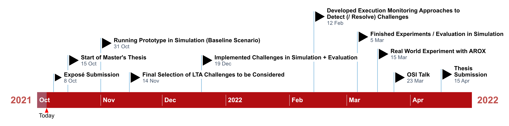

# Master's thesis at Osnabrueck University / DFKI

**Execution Monitoring for Long-Term Autonomous Plant Observation with a Mobile Robot**

Plan to interleave the reading / thinking / programming / experimenting and the writing.

## Dependencies for baseline simulation

- [arox_docker](https://git.ni.dfki.de/arox/arox_docker): dockerization of the AROX system
    - branch: `noetic`
- [arox_description](https://git.ni.dfki.de/arox/arox_core/arox_description): ROS launch files and URDF model for the AROX system
    - branch: `feature_sim_spawn`
- [container_description](https://git.ni.dfki.de/arox/container_description): ROS launch files and URDF model for the mobile container (charge station)
    - branch: `feature_simple_collisions`
- [innok_heros_description](https://git.ni.dfki.de/arox/innok_heros/innok_heros_description): URDF description for Innok Heros robot
    - branch: `arox_noetic`
- [innok_heros_driver](https://git.ni.dfki.de/arox/innok_heros/innok_heros_driver): ROS driver for the Innok Heros robot platform
    - branch: `master`
- [velodyne_simulator](https://bitbucket.org/DataspeedInc/velodyne_simulator/src/master/): URDF and gazebo plugin to provide simulated data from Velodyne laser scanners
    - branch: `master`
